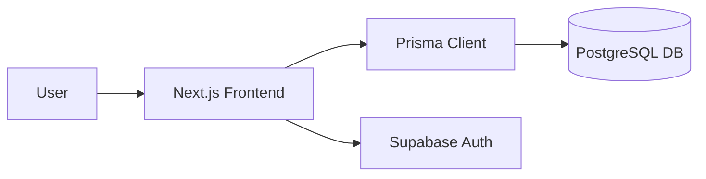

# 🚀 Katha Cinema App

> A comprehensive movie and entertainment database application with authentication and persistent storage.

### 🌐 Live Demo
[🚀 OPEN LIVE DEMO →](https://cinema-one-eta.vercel.app) | [💻 Source Code](https://github.com/YUVA-2329/cinema) 

---

## 🎬 Demo & 📸 Screenshots


*(Project preview and screenshots demonstrating the core user experience)*

---

## 🧠 About the Project

This project was built to solve real-world challenges through modern web technologies and advanced engineering. By combining scalable architecture with an intuitive user interface, Katha Cinema App provides an exceptional user experience while maintaining high performance and security.

### ✨ Key Features
- 🔐 Full user authentication via Supabase
- 🗄️ Relational database management using Prisma
- 🎬 Movie catalog and search functionality
- ✨ Smooth UI interactions with Framer Motion
- 📊 Dynamic image generation (html-to-image)

---

## 🛠️ Tech Stack

**Frontend:** Next.js 16, React, Tailwind CSS, Framer Motion
**Backend:** Supabase, Prisma ORM

---

## 🏗️ Architecture



---

## ⚙️ How It Works

1. User authenticates via Supabase.
2. The app fetches movie data and user watchlists utilizing Prisma ORM.
3. Updates to the watchlist are mutated via Next.js Server Actions.
4. The UI updates optimistically with Framer Motion animations.

---

## 🚀 Getting Started

### Installation

```bash
git clone https://github.com/YUVA-2329/cinema.git
cd katha-cinema-app
npm install
npx prisma generate
npm run dev
```

### Environment Variables
Create a `.env` file in the root directory:
```env
DATABASE_URL=YOUR_DB_URL
NEXT_PUBLIC_SUPABASE_URL=YOUR_URL
NEXT_PUBLIC_SUPABASE_ANON_KEY=YOUR_KEY
```

---

## 📁 Project Structure

```text
project/
├── app/
├── prisma/
├── components/
└── package.json
```

---

## 🛣️ Roadmap

- [x] Database Schema
- [x] Authentication
- [x] Core Movie Features
- [ ] Social sharing
- [ ] Recommendations engine

---

## 📊 Status

🟢 Active Development

---

## 👨‍💻 Author

**Yuva Kishore Peta**  
GitHub: [YUVA-2329](https://github.com/YUVA-2329)
